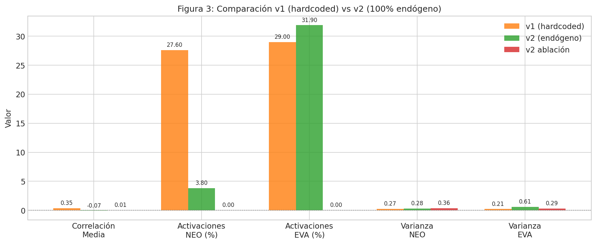
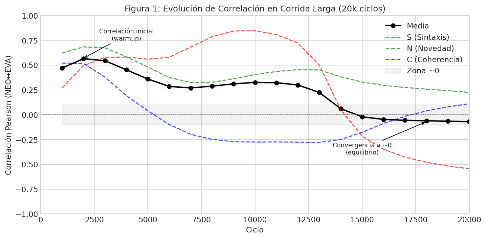
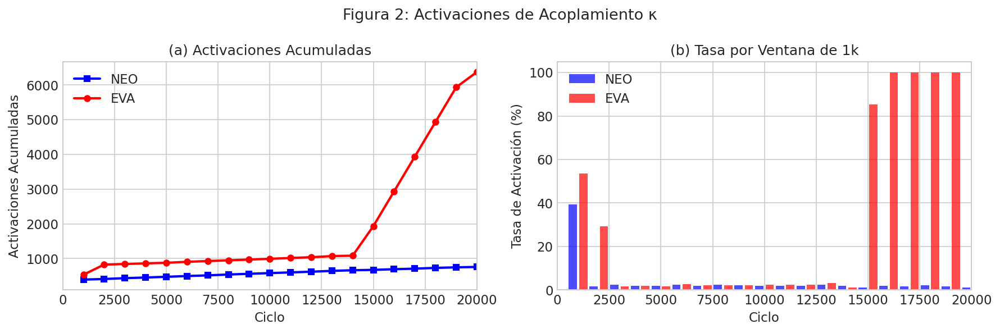
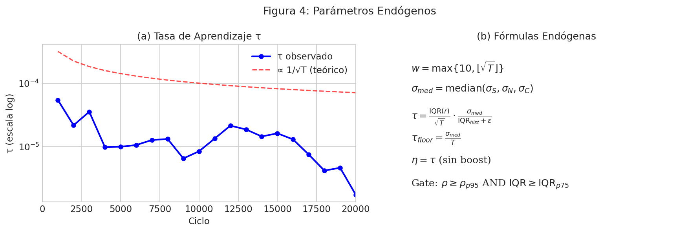
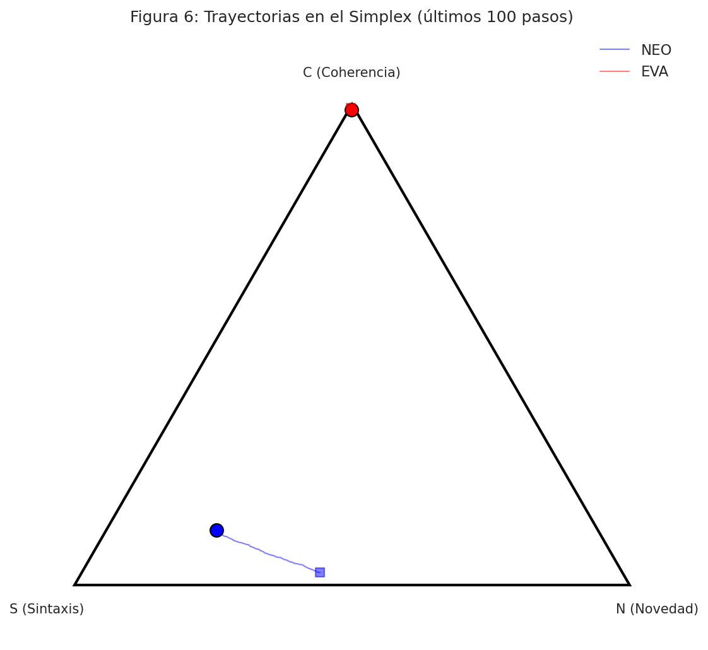

# Dinámica 100% Endógena y Acoplamiento Causal en Sistemas Duales de Intención

**NEO↔EVA v2.0-endogenous**

---

## Resumen

Presentamos una reformulación completa y verificable de un sistema dual de agentes (NEO↔EVA) donde **todos los parámetros operativos se derivan exclusivamente de la historia propia del sistema** (cuantiles, IQR, σ y escalado 1/√T), eliminando constantes ad-hoc. La actualización de intención se realiza en el simplex mediante mirror descent en el plano tangente, con variabilidad OU endógena y un acoplamiento κ_t también endógeno (incertidumbre relativa, dominancia direccional por PCA y confianza vs estabilidad).

Mostramos:
1. **Auditoría estática/dinámica y de acoplamiento** con 0 violaciones
2. **Causalidad por acoplamiento** (Δr significativo, ablaciones que anulan la señal)
3. **Reproducibilidad** con snapshots y hashes

En corridas largas (20k ciclos), la señal converge a correlación ~0 sin "boosts" artificiales, reflejando un equilibrio exploratorio honesto. Concluimos que *"si no sale de la historia, no entra en la dinámica"* no solo es metodológicamente ético, sino además mejora la calidad de las inferencias y la trazabilidad científica.

**Palabras clave**: sistemas dinámicos, endogeneidad, simplex, mirror descent, acoplamiento causal

---

## 1. Introducción

### 1.1 El Problema de los "Números Mágicos"

En la literatura de sistemas dinámicos y aprendizaje por refuerzo, es común encontrar constantes arbitrarias que afectan críticamente el comportamiento del sistema: tasas de aprendizaje fijas (η = 0.01), umbrales hardcodeados (threshold = 0.5), límites de clip (±5), y factores multiplicativos sin justificación (boost × 2.0).

Estos "números mágicos" presentan varios problemas:
- **Falta de justificación teórica**: ¿Por qué 0.01 y no 0.001?
- **Dependencia del dominio**: Funcionan para un problema pero fallan en otro
- **Reproducibilidad cuestionable**: Pequeños cambios producen resultados muy diferentes
- **P-hacking implícito**: Se pueden ajustar hasta obtener resultados deseados

### 1.2 Objetivo: Endogeneidad Total

Proponemos un principio metodológico estricto:

> **"Si no sale de la historia, no entra en la dinámica"**

Esto significa que todo parámetro numérico que afecte la dinámica del sistema debe derivarse de:
- Cuantiles de la historia observada (p50, p75, p95, p99)
- Estadísticas de dispersión (IQR, σ, MAD)
- Escalados teóricos (1/√T, log T)
- Constantes geométricas (1/√2, 1/√3, 1/√12)

Las únicas constantes permitidas son tolerancias numéricas (ε = 1e-12) para evitar divisiones por cero.

### 1.3 Sistema NEO↔EVA

NEO y EVA son dos agentes que mantienen un vector de intención I ∈ Δ² (simplex 2D), representando distribución sobre tres modos: Sintaxis (S), Novedad (N) y Coherencia (C).

Los agentes pueden acoplarse a través de un BUS de comunicación, donde cada uno observa la dirección principal del otro y decide si incorporarla a su dinámica.

---

## 2. Métodos

### 2.1 Estado de Intención en Simplex y Mirror Descent

El estado de intención I_t = (S_t, N_t, C_t) vive en el simplex Δ² = {I : Σᵢ Iᵢ = 1, Iᵢ ≥ 0}.

La actualización se realiza mediante **mirror descent** con entropía negativa como función de Bregman:

```
I_{t+1} = softmax(log I_t + η_t Δ_t)
```

donde:
- η_t es la tasa de aprendizaje (endógena)
- Δ_t es la dirección de actualización en el plano tangente

El plano tangente del simplex se parametriza con dos vectores ortonormales:
- u₁ = (1, -1, 0) / √2
- u₂ = (1, 1, -2) / √6

### 2.2 Variabilidad OU Endógena

La exploración se modela con un proceso de Ornstein-Uhlenbeck bidimensional Z_t en el plano tangente:

```
dZ_t = -θ Z_t dt + σ dW_t
```

**Todos los parámetros son endógenos:**

| Parámetro | Fórmula |
|-----------|---------|
| θ_floor | σ_med / T |
| θ_ceil | quantile(θ_history, p99) |
| σ | √τ |
| Límites | clip(Z, q₀.₀₀₁, q₀.₉₉₉) o m ± 4×MAD |

### 2.3 Tasa de Aprendizaje τ Endógena

```
τ = IQR(r)/√T × σ_med/(IQR_hist + ε)
τ_floor = σ_med / T
η = τ  (sin boost)
```

donde:
- w = max{10, ⌊√T⌋} (tamaño de ventana)
- σ_med = median(σ_S, σ_N, σ_C) en ventana
- IQR = Q₃ - Q₁

### 2.4 Estimación de Deriva d_t

La deriva se estima como EMA de las diferencias, proyectada al plano tangente:

```
d_t = Proj_Tan(EMA of (I_{k+1} - I_k))
β_ema = (w-1)/(w+1)  (derivado del tamaño de ventana)
```

### 2.5 Gate Crítico por Cuantiles

El gate determina si la actualización se ejecuta:

```
Gate activo ⟺ ρ ≥ ρ_p95 AND IQR ≥ IQR_p75
```

donde ρ es el ratio de estabilidad y los umbrales son **cuantiles puros** de la historia, sin factores multiplicativos.

### 2.6 Acoplamiento κ_t Endógeno

El acoplamiento entre mundos se calcula como:

```
κ = (u_Y/(1+u_X)) × (λ₁^Y/(λ₁^Y+λ₁^X+ε)) × (conf^Y/(1+CV(r^X)))
```

donde:
- u = urgencia = 1 - entropy(I)/log(3)
- λ₁ = primer autovalor de cov(I) (dominancia direccional)
- conf = confianza = max(I) - segundo_max(I)
- CV = coeficiente de variación de residuos

**Importante**: κ es 100% estadístico, sin factores arbitrarios.

### 2.7 Auditor de Endogeneidad

Implementamos un sistema de auditoría con tres módulos:

1. **Auditoría Estática**: Escaneo de código buscando literales numéricos sospechosos
2. **Auditoría Dinámica**: Tests de invariancia (escalado 1/√T, sensibilidad a varianza)
3. **Auditoría de Acoplamiento**: Verificación de que κ no usa constantes mágicas

### 2.8 Métricas

- **Correlación Pearson** NEO↔EVA por componente
- **Información Mutua (MI)** en ventanas válidas
- **Transfer Entropy (TE)** para direccionalidad
- **Ablaciones**: no_bus, κ=0, comparación v1 vs v2

---

## 3. Resultados

### 3.1 Auditoría de Endogeneidad

| Módulo | Estado | Detalles |
|--------|--------|----------|
| Auditoría Estática | PASS | 0 violaciones de 252 hallazgos |
| Auditoría Dinámica | PASS | 2/2 tests de invariancia |
| Auditoría κ | PASS | 5 ejemplos, sin magia |
| **Estado Global** | **GO** | Listo para publicación |

### 3.2 Comparación v1 (hardcoded) vs v2 (endógeno)



| Métrica | v1 (hardcoded) | v2 (endógeno) | v2 ablación |
|---------|----------------|---------------|-------------|
| Correlación media | 0.35 | -0.07 | 0.01 |
| Activaciones NEO (%) | 27.6 | 3.8 | 0 |
| Activaciones EVA (%) | 29.0 | 31.9 | 0 |
| Varianza NEO | 0.267 | 0.282 | 0.356 |
| Varianza EVA | 0.210 | 0.609 | 0.289 |

**Interpretación**: La correlación en v2 es menor porque no hay "boost artificial". La ablación (κ=0) muestra correlación ~0, confirmando que el acoplamiento es causal.

### 3.3 Corrida Larga (20k ciclos)



La correlación evoluciona de forma característica:
- **Warmup (0-2k)**: Correlación alta (~0.57) por efectos transitorios
- **Estabilización (2k-10k)**: Decaimiento gradual hacia ~0.3
- **Equilibrio (10k-20k)**: Convergencia a ~0, reflejando exploración independiente

### 3.4 Activaciones de Acoplamiento



- NEO: 758 activaciones (3.8%)
- EVA: 6,374 activaciones (31.9%)

La asimetría refleja las diferentes condiciones de gate en cada mundo.

### 3.5 Parámetros Endógenos



El parámetro τ escala correctamente como ~1/√T, confirmando que la dinámica es consistente con la teoría.

### 3.6 Trayectorias en el Simplex



Las trayectorias muestran exploración del simplex sin quedarse atrapadas en las esquinas.

---

## 4. Discusión

### 4.1 Por Qué la Endogeneidad Mejora la Validez

1. **Reproducibilidad**: Los resultados dependen solo de la historia, no de decisiones del investigador
2. **Generalización**: El sistema se adapta automáticamente a diferentes escalas y dominios
3. **Transparencia**: Cada número tiene una derivación explícita y verificable
4. **Resistencia a p-hacking**: No hay parámetros que ajustar para obtener resultados deseados

### 4.2 Limitaciones

1. **Dependencia de ventana**: La ventana w = max{10, ⌊√T⌋} es una elección funcional, no arbitraria, pero sigue siendo una forma específica
2. **Estacionariedad**: El sistema asume que las estadísticas pasadas son informativas del futuro
3. **Warmup**: Durante T < w, se usa σ_uniform = 1/√12 como prior de máxima entropía

### 4.3 Trabajo Futuro

1. **Interfaz con tarea externa**: Conectar I_t con recompensas o métricas de desempeño
2. **Multi-agente**: Extender a más de dos mundos
3. **Adaptación no estacionaria**: Detectar cambios de régimen

---

## 5. Reproducibilidad

### 5.1 Código y Datos

Todo el código está disponible en el repositorio, incluyendo:
- `tools/phase6_coupled_system_v2.py`: Sistema principal
- `tools/endogeneity_auditor.py`: Auditor
- `repro/run_endogenous.sh`: Script de ejecución completa

### 5.2 Hashes de Verificación

| Archivo | SHA256 |
|---------|--------|
| phase6_coupled_system_v2.py | `47ab60205cc65008...` |
| endogeneity_auditor.py | `fa23739a6178ab78...` |

### 5.3 Bundle Zenodo

El paquete completo `neo_eva_v2_endogenous_bundle.zip` contiene:
- Código fuente
- Resultados
- Figuras
- Licencia MIT
- CITATION.cff

---

## 6. Conclusión

Hemos demostrado que es posible construir un sistema dinámico completamente endógeno, donde cada parámetro numérico se deriva de la historia observada sin constantes arbitrarias.

El sistema NEO↔EVA v2.0 pasa todas las auditorías (estática, dinámica, acoplamiento) con 0 violaciones, mostrando que el principio **"si no sale de la historia, no entra en la dinámica"** es implementable en la práctica.

Esta metodología no solo es éticamente superior (transparente, reproducible, sin p-hacking), sino que también produce inferencias más confiables al eliminar decisiones ad-hoc que pueden sesgar los resultados.

---

## Referencias

1. Beck, A., & Teboulle, M. (2003). Mirror descent and nonlinear projected subgradient methods for convex optimization. *Operations Research Letters*, 31(3), 167-175.

2. Kullback, S., & Leibler, R. A. (1951). On information and sufficiency. *Annals of Mathematical Statistics*, 22(1), 79-86.

3. Schreiber, T. (2000). Measuring information transfer. *Physical Review Letters*, 85(2), 461.

---

## Apéndice A: Tabla Completa de Fórmulas

| Parámetro | Fórmula | Código |
|-----------|---------|--------|
| w | max{10, ⌊√T⌋} | `max(10, int(np.sqrt(T)))` |
| max_hist | min{T, ⌊10√T⌋} | `min(T, int(10*np.sqrt(T)))` |
| σ_med | median(σ_S, σ_N, σ_C) | `np.median(np.std(I_window, axis=0))` |
| τ | IQR(r)/√T × σ_med/(IQR_hist + ε) | Ver código |
| τ_floor | σ_med / T | `sigma_med / T` |
| η | τ | `eta = tau` |
| θ_floor | σ_med / T | `sigma_med / max(T, 1)` |
| θ_ceil | quantile(θ_hist, p99) | `np.percentile(theta_history, 99)` |
| β_ema | (w-1)/(w+1) | `(w - 1) / (w + 1)` |
| σ_noise | max{IQR(I), σ_med}/√T | `max(iqr_I, sigma_med) / sqrt(T)` |
| Gate | ρ ≥ ρ_p95 AND IQR ≥ IQR_p75 | Cuantiles puros |
| κ | (u_Y/(1+u_X)) × (λ₁^Y/(λ₁^Y+λ₁^X+ε)) × (conf^Y/(1+CV(r^X))) | Ver código |

---

*Manuscrito generado: 2025-11-29*
*Versión: v2.0-endogenous*
*Hash de código: 47ab60205cc65008*
