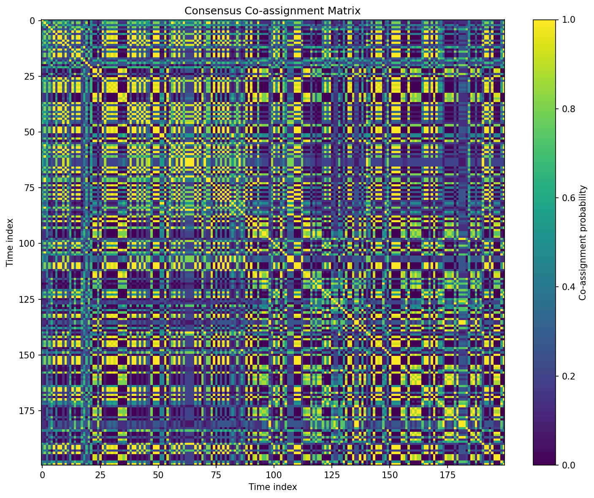
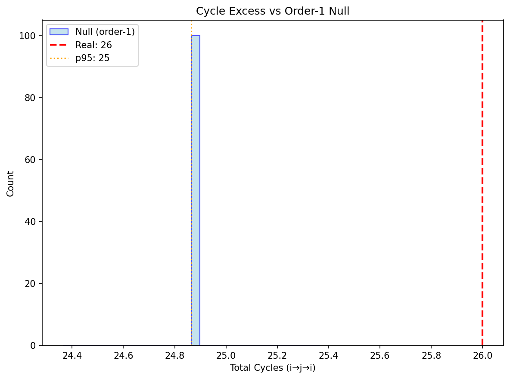
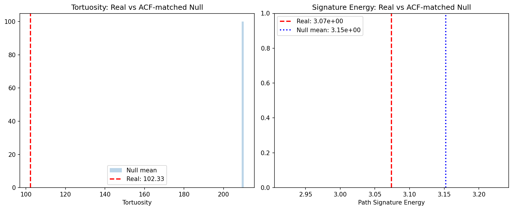

# Phase 15C: Robustness Report

**Timestamp:** 2025-11-30T19:15:01.879417
**Config:** n_steps=1000, n_nulls=200

## A) Consenso y Procrustes

| Agent | ARI (mean±CI95) | Procrustes < p50(null) |
|-------|-----------------|------------------------|
| NEO | 0.004 [-0.002, 0.012] | ✗ |
| EVA | 0.001 [-0.002, 0.008] | ✗ |

## B) Transiciones con Nulo Orden-1

| Agent | Δ_asymmetry | z-score | p-value | Cycles excess |
|-------|-------------|---------|---------|---------------|
| NEO | 639.050 | 10.19 | 0.000 | ✗ |
| EVA | 630.279 | 12.02 | 0.000 | ✗ |

## C) GNT Intencionalidad de Ruta

- **Path length:** 44.71
- **Tortuosity:** 102.33 (null mean: 209.69)
- **Signature energy:** 3.07e+00
- **Tortuosity > p95(null):** ✗
- **Signature > p95(null):** ✗

**Conditioned on Integration >= p90:**
- N points: 692
- Tortuosity: 42.62 (p=0.000)
- Signature: 4.03e+00 (p=0.000)

## D) GO Criteria

| Criterion | Status |
|-----------|--------|
| ARI_consensus > 0.5 | ✗ NO-GO |
| Procrustes < p50(null) | ✗ NO-GO |
| Delta_asymmetry significant | ✓ GO |
| Cycles_excess > p95 | ✗ NO-GO |
| Tortuosity > p95(null) | ✗ NO-GO |
| Signature > p95(null) | ✗ NO-GO |
| Conditioned_tort_p < 0.05 | ✓ GO |
| Conditioned_sig_p < 0.05 | ✓ GO |

**Total: 3/8 criteria passed**