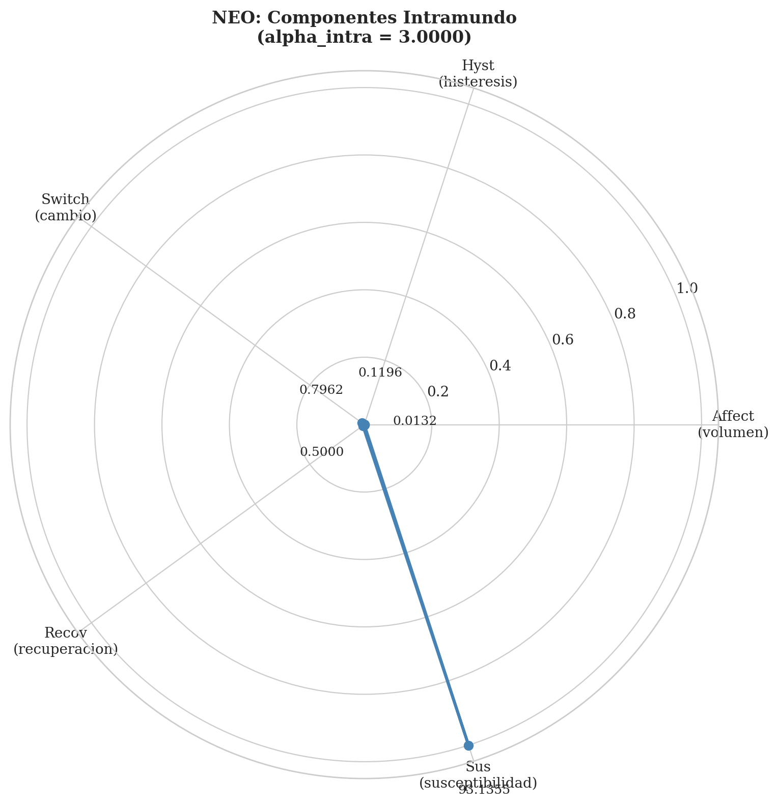
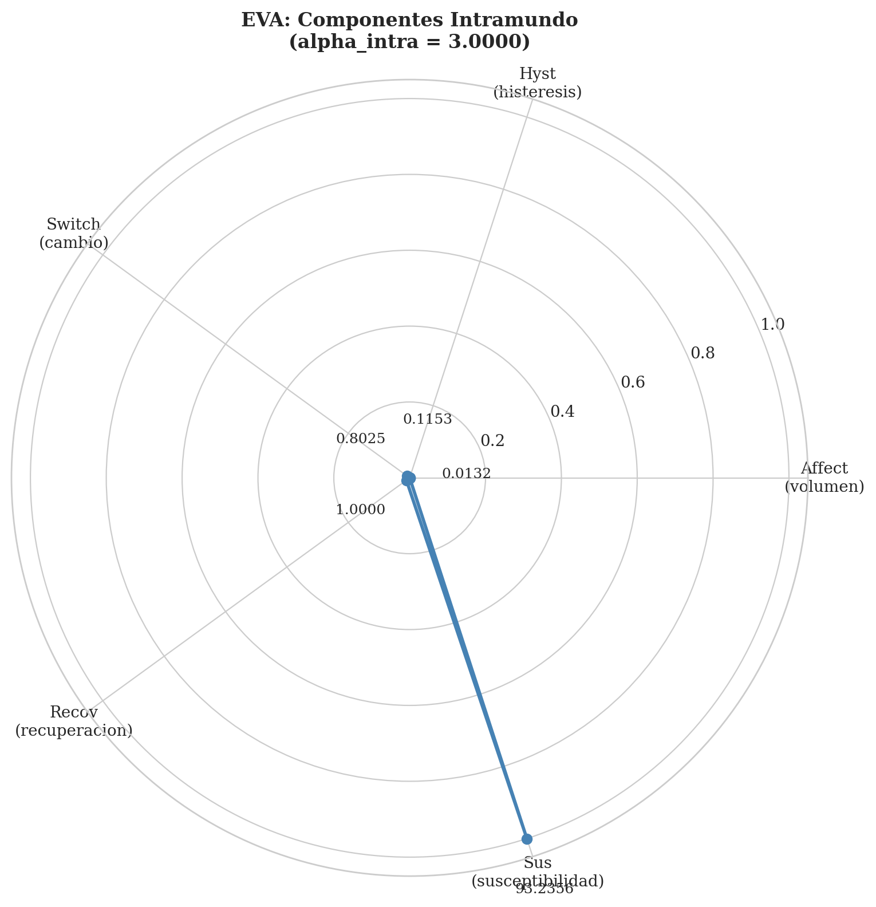
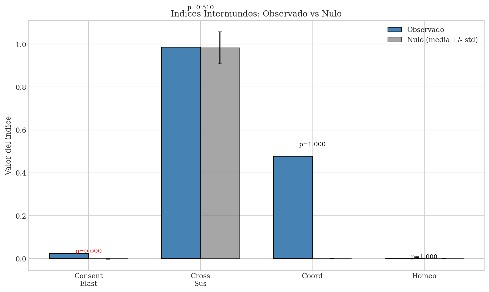
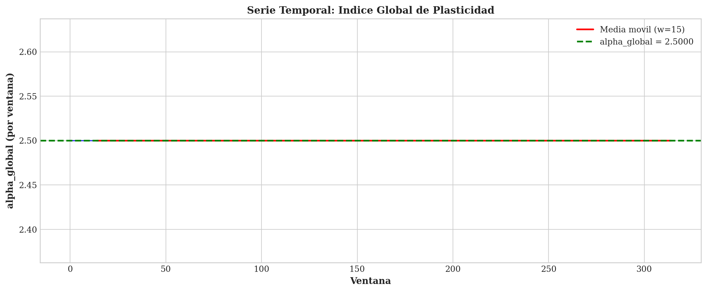
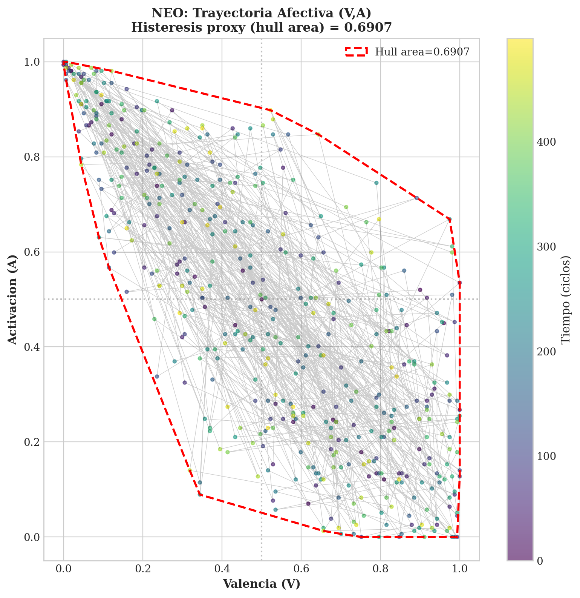
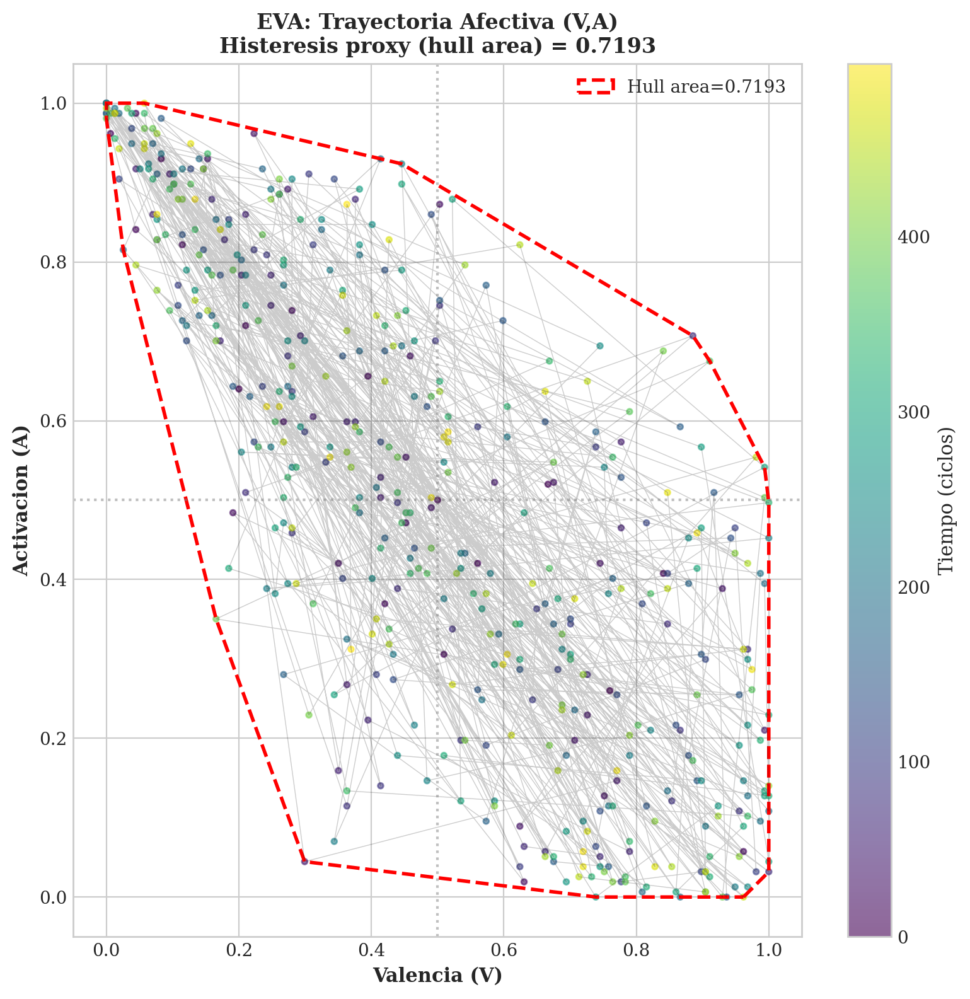

# Phase 9: Plasticidad Afectiva - Reporte

**Generado:** 2025-11-30 12:44:54 UTC

---

## 1. Metodologia

### 1.1 Ventanas y Estandarizacion

- Ventana deslizante: w = max(10, sqrt(T))
- Estandarizacion robusta: x_tilde = (x - med_w) / (IQR_w + eps)
- eps = minimo positivo representable del dtype

### 1.2 PAD Latente

Coordenadas afectivas calculadas por ranks en ventana w:
- V (Valencia) = rank_w(R_soc + h - r)
- A (Activacion) = rank_w(m + e)
- D (Dominancia) = rank_w(c + s)

---

## 2. Indices Intramundo

### 2.1 NEO

| Componente | Valor | Descripcion |
|------------|-------|-------------|
| alpha_affect | 0.013152 | sqrt(det(Cov_w([V,A,D]))) - volumen afectivo |
| alpha_hyst | 0.119559 | Area poligonal (shoelace) de (V,A) en ventana |
| alpha_switch | 0.796178 | Tasa de cambio de estado en ventana |
| alpha_recov | 0.500000 | 1/med(tau) - inverso del tiempo de recuperacion |
| alpha_sus | 93.135483 | med(chi) - susceptibilidad OU endogena |
| **alpha_intra** | **3.0000** | Suma de ranks normalizados |

### 2.2 EVA

| Componente | Valor | Descripcion |
|------------|-------|-------------|
| alpha_affect | 0.013197 | sqrt(det(Cov_w([V,A,D]))) - volumen afectivo |
| alpha_hyst | 0.115339 | Area poligonal (shoelace) de (V,A) en ventana |
| alpha_switch | 0.802548 | Tasa de cambio de estado en ventana |
| alpha_recov | 1.000000 | 1/med(tau) - inverso del tiempo de recuperacion |
| alpha_sus | 93.235621 | med(chi) - susceptibilidad OU endogena |
| **alpha_intra** | **3.0000** | Suma de ranks normalizados |

---

## 3. Indices Intermundos

| Componente | Valor | Descripcion |
|------------|-------|-------------|
| alpha_consent_elast | 0.024895 | IQR_w(Delta_p / Delta_pi) - elasticidad del consentimiento |
| alpha_cross_sus | 0.986842 | Theil-Sen de Delta_PAD entre mundos durante consent |
| alpha_coord | 0.477533 | IQR(r_PAD(+1) - r_PAD(-1)) - coordinacion por modos |
| alpha_homeo | 0.000000 | IQR(Delta_R_soc_ema) - homeostasis de reciprocidad |
| **alpha_inter** | **2.5000** | Suma de ranks normalizados |

---

## 4. Indices Estructurales

| Componente | Valor | Descripcion |
|------------|-------|-------------|
| alpha_weights | 0.001649 | sum_i IQR_w(Delta_w_i) - movilidad de pesos adaptativos |
| alpha_manifold | 1.666163 | IQR_w(Delta_coords) - deriva en variedad latente PCA |
| **alpha_struct** | **1.5000** | Suma de ranks normalizados |

---

## 5. Indice Global

**alpha_global = 2.5000**

Composicion:
- rank(alpha_intra_NEO) + rank(alpha_intra_EVA) + rank(alpha_inter) + rank(alpha_struct)

Componentes:
- alpha_intra_NEO: 3.0000
- alpha_intra_EVA: 3.0000
- alpha_inter: 2.5000
- alpha_struct: 1.5000

---

## 6. Trayectorias Afectivas (Histeresis)

### 6.1 NEO

### 6.2 EVA

---

## 7. Nulos Bootstrap

| Indice | Observado | Nulo (media) | Nulo (std) | p-value |
|--------|-----------|--------------|------------|---------|
| neo_alpha_affect | 0.013152 | 0.023171 | 0.000265 | 1.000 |
| neo_alpha_hyst | 0.119559 | 0.428185 | 0.024972 | 1.000 |
| neo_alpha_switch | 0.796178 | 0.797771 | 0.002758 | 1.000 |
| eva_alpha_affect | 0.013197 | 0.023092 | 0.000289 | 1.000 |
| eva_alpha_hyst | 0.115339 | 0.415141 | 0.026207 | 1.000 |
| eva_alpha_switch | 0.802548 | 0.801847 | 0.001993 | 0.890 |
| inter_alpha_consent_elast | 0.024895 | 0.000854 | 0.002506 | **0.000** |
| inter_alpha_cross_sus | 0.986842 | 0.982678 | 0.074709 | 0.510 |
| struct_alpha_weights | 0.001649 | 0.001649 | 0.000000 | 1.000 |
| struct_alpha_manifold | 1.666163 | 1.118872 | 0.013779 | **0.000** |

---

## 8. Notas Metodologicas

1. Todos los indices calculados sin constantes fijas
2. Parametros derivados de: cuantiles, IQR, sqrt(T), ACF, PCA, ranks
3. Nulos generados por: block shuffle, phase surrogates, coupling shuffle
4. Bootstrap: 100 iteraciones

---

*Reporte generado automaticamente. Sin interpretacion de resultados.*
